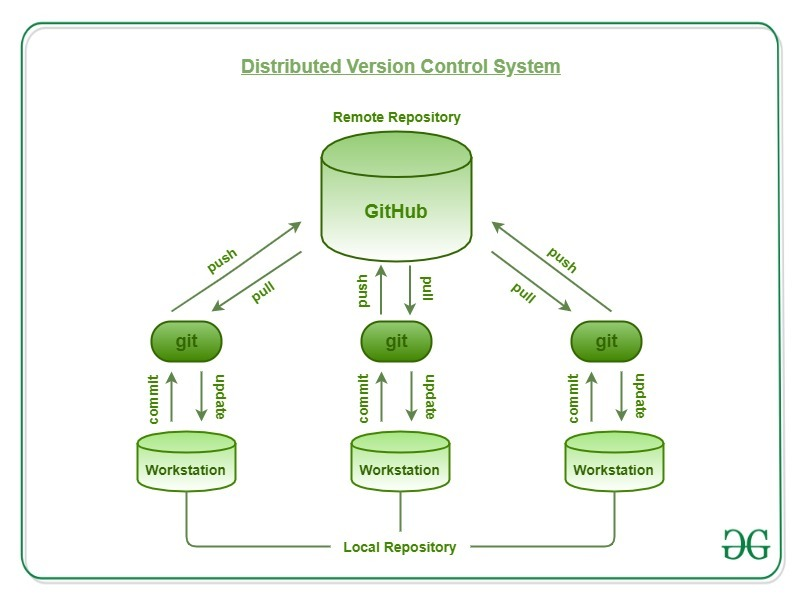

# To render this markdown file
Right click within the open markdown text editor area and you should get a menu option "Show markdown preview". 
Select that and it will render the text into markdown in another window (side by side by default).


# Quick overview of Git
Git is a free and open source distributed version control system designed to handle everything from small to very large projects with speed and efficiency. 
Git ensure control version between a repository (eg a directory with your code) hosted on a server like [github.com](https://github.com) or [bitbucket.org](https://bitbucket.org/) (both have free plans) and a local repository stored on your pc. 

The version control handles multiple users, and multiple versions (or branches) between the remote repository and the local repositories.

Below are the steps necessary to create a repository from scratch using command line.
GUI are also available, see for example the [gui](https://desktop.github.com/) developed by github.

## Create an account on a git server
First you need an account on a git server like. For example you can create one on [github.com](https://github.com).
In the following steps I'll used the following account [3dfirelab](https://github.com/3dfirelab)

## Create the local repository
I create here a directory with a pyhton script that print `"Hello World"` and a readme file that show the name of the repository.
```
mkdir HelloWorld
cd HelloWorld
echo 'print("Hello World")' > mycode.py
echo "# MyHelloWorld" >> README.md
```
to test the code
```
python mycode.py
```

## Initialisation
create a remote repository, for example on [github.com](https://github.com) name `MyHelloWorld`.
Then you need to add you ssh key to your account to let you computer connect to the github server.
To do so, go to `Settings` in the right meny located in you avatar.
Then go to the left tab `SSH and GPG keys`, and add your ssh key you can get from 
```
cat ~/.ssh/id_rsa.pub
```
Then from the directory `HelloWorld`, 
```
git init
git add README.md
git add mycode.py
git commit -m "first commit"
git branch -M main
git remote add origin git@github.com:3dfirelab/MyHelloWorld.git
git push -u origin main
```
`main` is the name of the default branch.
you now have the two files `mycode.py` and the `README.md` on the remote server.


### status of you local files
let's change you code.
```
echo 'print("my new Hello World")' > mycode.py
```
to show the status of you local repository
```
git status
```
it will shows
```
On branch main
Changes not staged for commit:
  (use "git add <file>..." to update what will be committed)
  (use "git restore <file>..." to discard changes in working directory)
	modified:   mycode.py

no changes added to commit (use "git add" and/or "git commit -a")
```

### udpate the remote repository
to update the version of `mycode.py` on the remote repository, first add commit the modified file to you local repository
```
git add mycode.py
git commit -m 'my second commit'
```
and then push the modification on the remote server
```
git pull origin main
```

### clone a repository from github
to download your repository on a new pc. 
```
git clone git@github.com:3dfirelab/MyHelloWorld.git
```


# References
* https://www.atlassian.com/git/tutorials
* https://www.geeksforgeeks.org/git-features/