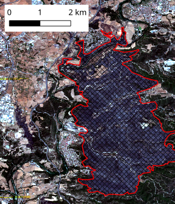
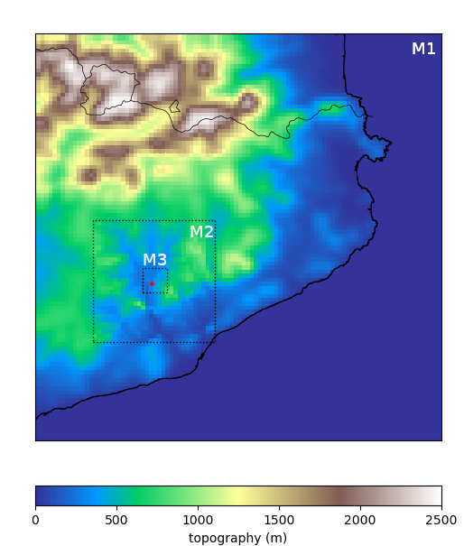
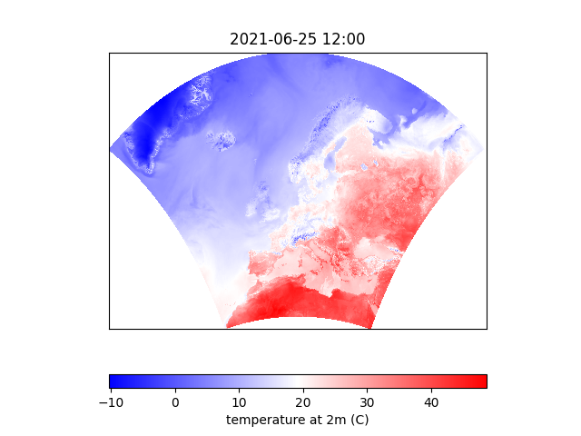
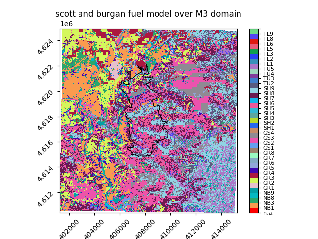

# Projects of the python course

## 1. **Introduction** 

## 1.1 Presentation
Three of the projects are on the analysis of wind and vegetation data that we will be using later on during the fire behavior course. We focus here on reading data and processing simple statistical analysis. The project consists in reading raster files (e.g. tif, netcdf) or vector files (e.g. shapefile), running GIS task and processing extracted data.

The Fire occurred in El pont de Vilomara on the 17th of July 2022. Information on the fire can be found [here](https://interior.gencat.cat/web/.content/home/030_arees_dactuacio/bombers/foc_forestal/consulta_incendis_forestals/informes_incendis_forestals/2020-2029/2022/20220717_I_REC_Pont-de-Vilomara_ES.pdf)  

A fourth project is more "FDS" orientated. Using a vegetation fire from the validation test case, we compute various fire behavior metrics using the `fdsreader` library to extract directly FDS data into python.

## 1.2 Deliverables
When developing your python code, keep in mind to use functions and classes when advantageous.

The deliverables are:
1. the code that will be shared in a git repository (see [04-usingGit.md](./04-usingGit.md))
2. a Short PDF document with the link to the git repository and sections highlighting answer to question listed in the tasks of the project description.   

## 2. **Project Description**

## 2.1. Compare atmospheric data simulated with different atmospheric model resolution 
**objectives:**
The objective of this project is to compare atmospheric data from 3 run of the atmospheric model [MESONH](http://mesonh.aero.obs-mip.fr/mesonh57) run at 3 different resolutions: M1 (2km), M2(400m), M3(80m). The 3 models come from the same two-way nested simulation. A two-way nested simulation involves simulation models that interact with each other, allowing information to flow in both directions. This is common in atmospheric models where different scales or processes are interdependent, and each model can influence the other. Here the three model are nested with a focus on the area around el Pont de Vilomara.

We want to observe the differences between the models on variable such as: wind at 10m, wind gust at 10m, temperature at 2m, relative humidity at 2m, or boundary layer height.  

**tasks:** a non-exhaustive list of task to perform:
- read raster data from the MESONH netcdf output files
- mask the area of the fire to extract atmospheric data in the area of the fire. - output the atmospheric variables in geopandas data frame format.
- perform comparison between M1, M2 and M3 ambient condition on the burn area.
    - highlight the gain of higher resolution model on wind data.
    - show difference in variance and diurnal variation.  

**data** are available on andromeda at:
- MesoNH files: `/data/IMFSE/PythonCourse/MNH/`
- burn area: `/data/IMFSE/PythonCourse/PontdeVilomara/burntArea/`

## 2.2. Evaluate the ambient condition scenario anomaly
**objectives** 
The objectives are to compare high resolution simulated atmospheric data of the 16 and 17th of July 2022 from MesoNH (see project 1) against 21 years of Reanalysis data spanning from 2000 to 2021.  
The Copernicus European Regional ReAnalysis ([CERRA](https://cds.climate.copernicus.eu/cdsapp#!/dataset/10.24381/cds.622a565a?tab=overview)) was uploaded on andromeda, see data section below for location. 4 variables are available every 6h at 5.5km resolution for all europe:
- `wdir10`: 10m wind direction , 
- `si10`': 10m wind speed, 
- `r2`   : relative humidity at 2m
- `t2m` : temperature at 2m.

The objective is to see how much the ambient condition on the day of the fire were exceptional.

**tasks**: a non-exhaustive list of tasks to perform:
- read MESONH and CERRA data
- resample to CERRA resolution,
- mask the zone of the fire,
- output CERRA data and MESONH data for the fire area in geopandas data frame
- compare CERRA and MESONH data and evaluate the anomaly.

**data** are available on andromeda at:
- MesoNH files: `/data/IMFSE/PythonCourse/MNH/`
- burn area: `/data/IMFSE/PythonCourse/PontdeVilomara/burntArea/
- CERRA files: `/data/paugam/CDS/CERRA`. see .py file in directory for example f how to load CERRA data.

## 2.3. Vegetation Map Analysis
**objectives** The objectives are to compare atmospheric data, cover map/topography use in the atmospheric model, and fuel/topography map data used in fire model. In particular, we are interested in plotting covariance matrix to observe variables dependence.

**tasks:** a non-exhaustive list of tasks to perform:
- read atmospheric data (wind, temperature, relative humidity) from M3 model
- read cover map used in MESONH. you need to concatenate all coverXXX variable from the PGDM3.nc file in one map. The cover map are from the ecoclimap dataset (see [here](https://www.umr-cnrm.fr/surfex/spip.php?article219
) for the list of the cover map). 
- read topography and compute slope
- read fuel model map that will be used in fire model. The map are available in LCP tif file.
- resample LCP data to MESONH grid using [rasterio.warp.reproject](https://rasterio.readthedocs.io/en/stable/api/rasterio.warp.html#rasterio.warp.reproject), see example in [05a-GIS-rasterio.ipynb](05a-GIS-rasterio.ipynb)
- mask the burn area
- output in a geopandas data frame for all pixel in the burn area:
  - from MESONH: cover map , altitude, slope, atmospheric data
  - from the fuel model (LCP file): fuel model (Scott and Burgan 2005), altitude, slope
- study covariance between MESONH and LCP data.
- study covariance of atmospheric data in the burn zone with fuel, cover map and orography data.
- use the `seaborn` library with for example [pairplot](https://seaborn.pydata.org/generated/seaborn.pairplot.html) and [heatmap](https://seaborn.pydata.org/examples/many_pairwise_correlations.html) function that can be applied to pandas data frame.

**data** are available on andromeda at:
- MesoNH files: `/data/IMFSE/PythonCourse/MNH/`
- burn area: `/data/IMFSE/PythonCourse/PontdeVilomara/burntArea/`
- LCP data: `/data/IMFSE/PythonCourse/LCP/lcp_pgd80.tif` see `.py` file in same directory to load `lcp_pgd80.tif`

## 2.4. Postprocessing of CSIRO C064 simulation
**objectives:** the objectives are to load fds device and slice files to run analysis directly in python. 3 simulation are available on andromeda, see data section below.

**tasks:** a non-exhaustive list of tasks to perform:
- read FDS simulation using `fdsreader`. see [06-fdsreader.ipynb](./06-fdsreader.ipynb) for example of how to use `fdsreader`.
- From the device file data (see device `ID='x'` and `ID='D'`), compute fire behavior metrics such like ROS, flame depth, and residence time along the center line of the ellipse. Compare with results from the [validation guide](./Data/FDS_Validation_Guide.pdf) page 1102-1103 or original publication ([Mell et al 2007](https://tsapps.nist.gov/publication/get_pdf.cfm?pub_id=861373)).
- Using slice of `HRRPUV` available a `dt=5s`, develop an algorithm to compute 2D map of arrival time. In this map, each pixel mark the time of arrival of the fire front as observed in the slice file. To get a continuous map you need to interpolate between available points (see `scipy` function [griddata](https://docs.scipy.org/doc/scipy/reference/generated/scipy.interpolate.griddata.html) ).
- From the arrival time map, compute ROS.
- perform the 1D and 2D ROS calculation above for the 3 simulations.
- compare ROS between 1D and 2D, and in between simulation (i.e. effect of wind and fuel load).

  
**data:** FDS simulations are on andromeda at `/data/IMFSE/PythonCourse/FDS/`. Three simulations are available. There are one reference simulation, the same as the one in the validation guide and two others with different wind speed and fuel load:
1. `Case_C064_Validation677` - the reference simulation.
2. `Case_C064_Validation677_windPlus`
3. `Case_C064_Validation677_fuelLoadPlus`
